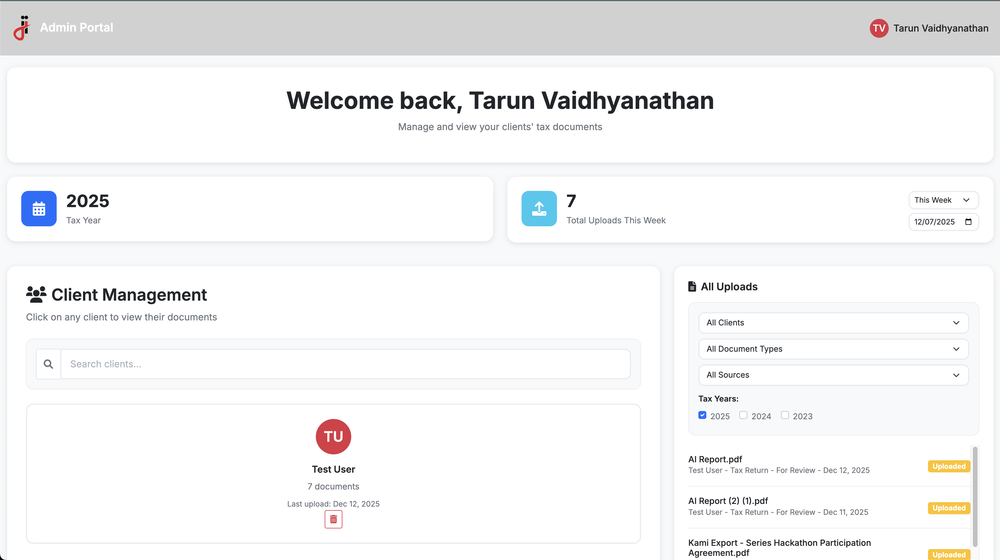
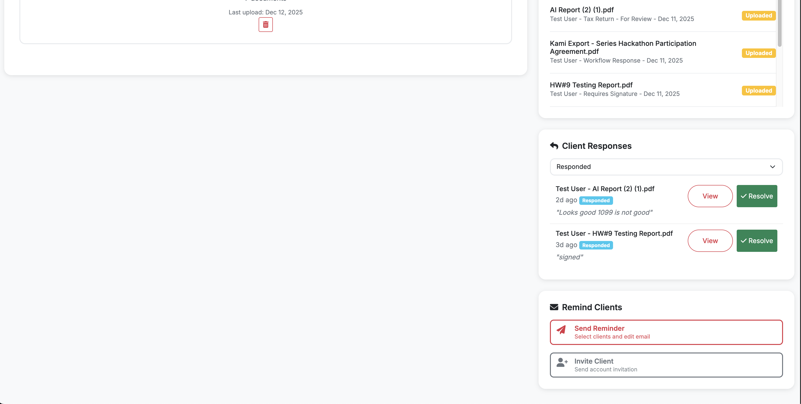
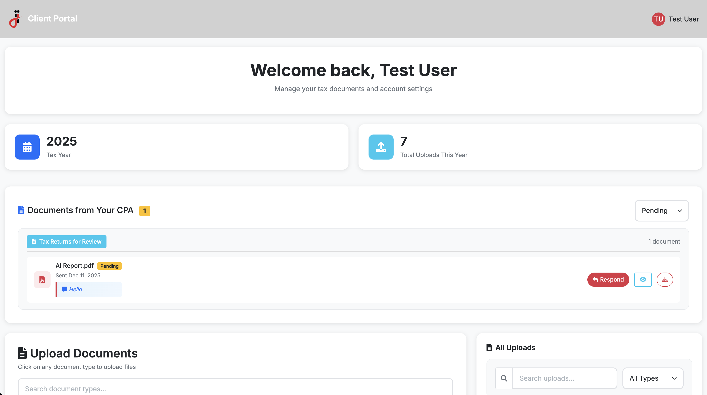
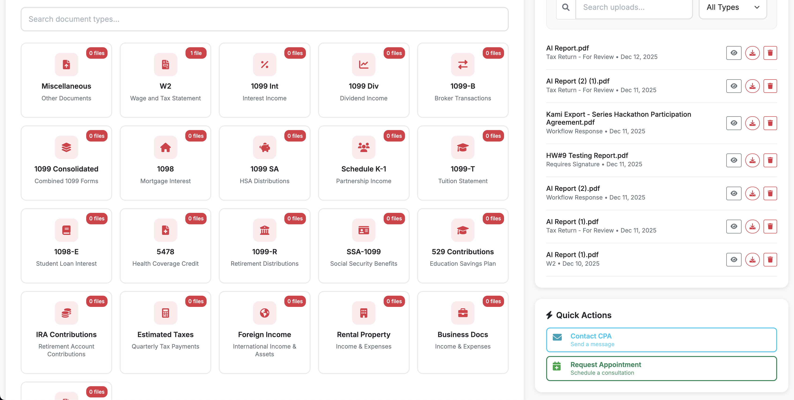

# CPA Client Portal

A secure, full-stack client portal built for a CPA firm, enabling encrypted document exchange and client management. Features role-based access control, AES-256-GCM encryption at rest, and a modern responsive interface.

## Features

- **Secure Document Management** - Upload, download, and organize documents with AES-256-GCM encryption at rest and SHA256 integrity verification, with Azure Blob Storage integration
- **Role-Based Access Control** - Separate Admin and Client dashboards with appropriate permissions
- **Invitation-Based Registration** - Admins invite clients via email with secure token-based account setup
- **Client Management** - Admin dashboard for managing client accounts, documents, and communications
- **Email Notifications** - SMTP integration for account invitations, password resets, and contact form submissions
- **Responsive Design** - Mobile-friendly interface built with Bootstrap 5

## Tech Stack

| Layer | Technology |
|-------|------------|
| **Framework** | ASP.NET Core 8 MVC |
| **Language** | C# 12 |
| **ORM** | Entity Framework Core 9 |
| **Database** | Azure SQL Database |
| **Authentication** | ASP.NET Core Identity |
| **File Storage** | Azure Blob Storage with AES-256-GCM encryption |
| **Frontend** | Bootstrap 5, jQuery, Font Awesome 6 |
| **Email** | SMTP (SendGrid compatible) |

## Security

Security was a primary focus given the sensitive nature of financial documents:

- **Encryption at Rest** - All documents encrypted using AES-256-GCM before upload to Azure Blob Storage
- **Integrity Verification** - SHA256 hashing ensures documents haven't been tampered with
- **Secure Authentication** - ASP.NET Core Identity with configurable password policies and account lockout
- **CSRF Protection** - Antiforgery tokens on all state-changing operations
- **Secure Cookies** - HttpOnly, Secure, and SameSite attributes enforced
- **Rate Limiting** - Protection against brute force attacks on authentication endpoints

## Architecture

```
┌─────────────────────────────────────────────────────────────────┐
│                        Client Browser                           │
└─────────────────────────┬───────────────────────────────────────┘
                          │ HTTPS
┌─────────────────────────▼───────────────────────────────────────┐
│                     ASP.NET Core MVC                            │
│  ┌─────────────┐  ┌─────────────┐  ┌─────────────────────────┐  │
│  │ Controllers │  │    Views    │  │   Identity Middleware   │  │
│  └──────┬──────┘  └─────────────┘  └─────────────────────────┘  │
│         │                                                       │
│  ┌──────▼──────────────────────────────────────────────────┐    │
│  │                    Services Layer                       │    │
│  │  ┌────────────────┐  ┌────────────────────────────────┐ │    │
│  │  │  EmailService  │  │  EncryptedBlobStorageService   │ │    │
│  │  └────────────────┘  │  (AES-256-GCM + SHA256)        │ │    │
│  │                      └───────────────┬────────────────┘ │    │
│  └──────┬───────────────────────────────┼──────────────────┘    │
│         │                               │                       │
│  ┌──────▼──────┐              ┌─────────▼─────────┐             │
│  │  EF Core    │              │  Azure Blob SDK   │             │
│  └──────┬──────┘              └─────────┬─────────┘             │
└─────────┼───────────────────────────────┼───────────────────────┘
          │                               │
┌─────────▼────────────┐     ┌────────────▼────────────────────────┐
│  Azure SQL Database  │     │  Azure Blob Storage (Encrypted)     │
└──────────────────────┘     └─────────────────────────────────────┘
```

## Screenshots

### Admin Dashboard
Centralized client management with document oversight, workflow tracking, and batch operations.


*Admin dashboard showing client grid, stats, and filters*


*Upload list with status tracking and client response management*

### Client Portal
Professional document upload interface with organized tax document categories and CPA communication.


*Client dashboard with welcome message, stats, and document type grid*


*Document management with uploads sidebar and quick actions*

## Getting Started

### Prerequisites
- .NET 8 SDK
- SQL Server (LocalDB or full instance)
- SMTP server (optional, for email functionality)

### Configuration

1. Clone the repository
2. Update `appsettings.json` with your database connection string
3. Configure SMTP settings for email functionality (or use development mode)
4. Run database migrations:
   ```bash
   dotnet ef database update
   ```
5. Run the application:
   ```bash
   dotnet run
   ```

### Default Roles
The application uses two roles:
- **Admin** - Full access to client management and all documents
- **Client** - Access to personal dashboard and own documents only
